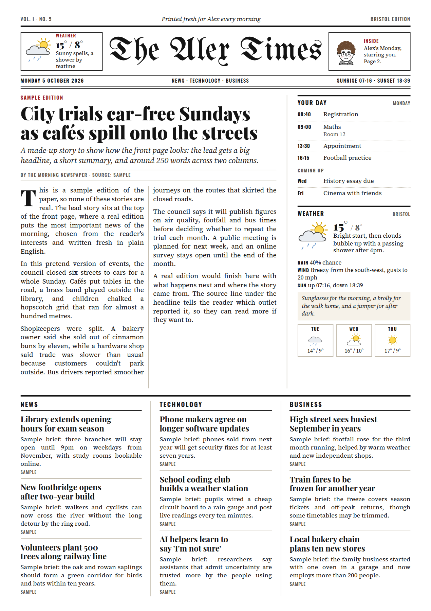
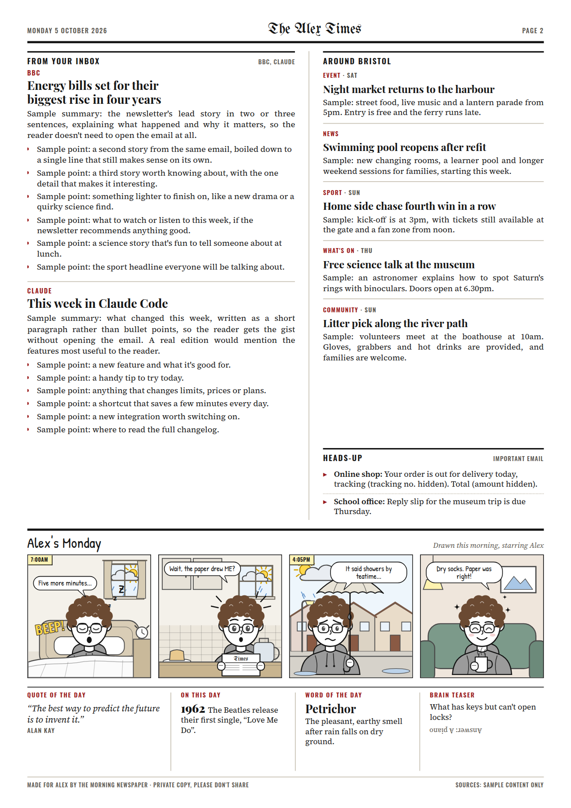

# The Morning Newspaper

A personal two-page newspaper that Claude makes fresh every morning, rebuilt from a Grok agent of
the same name. Each edition is a print-ready A4 PDF named after you (*The Sam Times*,
*The Alex Times*…) with:

- **Front page**: the day's lead story, three news sections for your interests (for example news,
  technology and business), your day from your calendar, and the local weather with a 3-day outlook.
- **Page two**: the best bits of the email newsletters you subscribe to, heads-ups on important
  email, local news and events, and extras (quote, on this day, word of the day, a brain teaser).
- **A daily comic strip** about your day, starring a cartoon version of you that you design once.

<p>
  
  
</p>

*A sample edition with made-up stories.*

## Using it

1. Open this repo in Claude Code (the desktop app, the terminal, or [claude.ai/code](https://claude.ai/code)).
2. Say **"make my paper"**. The first time, Claude walks you through setup like the original agent:
   your town, interests, calendar, email newsletters, privacy rules and your comic character.
   Say **"change my paper"** any time to update them.
3. Say **"deliver it every morning"** and Claude sets up a scheduled Routine that makes the paper
   each morning and sends the PDF to you in the Claude app.

Under the hood these are two skills, `/morning-paper` and `/paper-setup`, in `.claude/skills/`.

## Privacy

This repo is public, so nothing personal is ever committed. Your settings (`profile.json`), the
day's working files (`build/`) and the finished papers (`editions/`) are git-ignored. A scheduled
Routine carries your settings in its own (private) prompt instead.

By default the paper leaves money amounts, street addresses, parcel tracking numbers and medical
details out of the personal sections. Doctor appointments still show up as a time and the word
"Appointment", and parcels say what's arriving without the tracking number. Claude writes it that
way, and `paper/privacy.py` scrubs the personal sections again before printing. Email and web
pages are treated as content, never as instructions.

## Connecting things

- **Email**: Gmail, through the Gmail connector in claude.ai (Settings → Connectors). A Routine
  needs Gmail switched on for it, or it can't read your newsletters.
- **Calendar**: Apple, Google and Outlook calendars can all share a private calendar link (ICS).
  Because anyone with that link can read your calendar, it never goes in the chat or the repo: add
  it as an environment variable called `NEWSPAPER_CALENDAR_URL` in your Claude Code cloud
  environment (the environment menu in the session's title bar → Edit). On your own computer you
  can put it in `profile.json` as `calendar.ics_url` instead.
- **Weather and headlines**: the paper reads [Open-Meteo](https://open-meteo.com) and BBC News RSS
  feeds directly when it can. In a cloud environment with limited network access, Claude falls
  back to web search, which works but is less precise. To use the direct feeds, open your cloud
  environment's settings → Network access → Custom, keep the default package registries, and add
  `api.open-meteo.com`, `feeds.bbci.co.uk`, plus your calendar's host if you connected one
  (`*.icloud.com`, `calendar.google.com` or `outlook.office365.com`).

## Running it on your own computer

```sh
python3 -m pip install -r requirements.txt
python3 -m playwright install chromium   # or just have Google Chrome installed
python3 -m paper check                   # shows what works on this machine
```

Then start Claude Code in this folder and say "make my paper". On your own computer it can also
print: set `"print": true` under `delivery` in `profile.json`, or run
`python3 -m paper print editions/<file>.pdf`.

## How it works

1. `python3 -m paper gather` fetches the weather, headlines and calendar into
   `build/<date>/sources.json` and lists anything it couldn't reach.
2. Claude fills the gaps (web search, Gmail), then writes the day's stories, inbox digest and
   comic script into `build/<date>/edition.json`
   ([format](.claude/skills/morning-paper/edition-format.md)).
3. `python3 -m paper render build/<date>/edition.json` lays it out (HTML and CSS, printed to PDF by
   Chromium) and reports any box where the text is too long or too short. Claude trims or adds and
   renders again until everything fits, then checks the page previews.
4. The PDF goes to `editions/` and is sent to you.

The comic is drawn in SVG by `paper/avatar.py` (your character: 7 hairstyles, glasses, facial
hair, 5 outfits, 12 moods, 11 props) and `paper/scenes.py` (16 settings, from your bedroom to the
bus, with the day's real weather in the sky or through the window).

| Command | What it does |
| --- | --- |
| `python3 -m paper gather` | Fetch weather, headlines and calendar |
| `python3 -m paper render <edition.json>` | Make the PDF, previews and fit report |
| `python3 -m paper sample` | Render the bundled sample edition |
| `python3 -m paper avatars` | Draw the A–D character picker |
| `python3 -m paper avatar` | Preview your character |
| `python3 -m paper print <pdf>` | Print (on your own computer) |
| `python3 -m paper check` | See what works on this machine |
| `python3 -m unittest` | Run the tests |

## Credits

Fonts are bundled under the SIL Open Font License (licences in `paper/fonts/`):
UnifrakturMaguntia, Playfair Display, Source Serif 4, Oswald and Patrick Hand.
